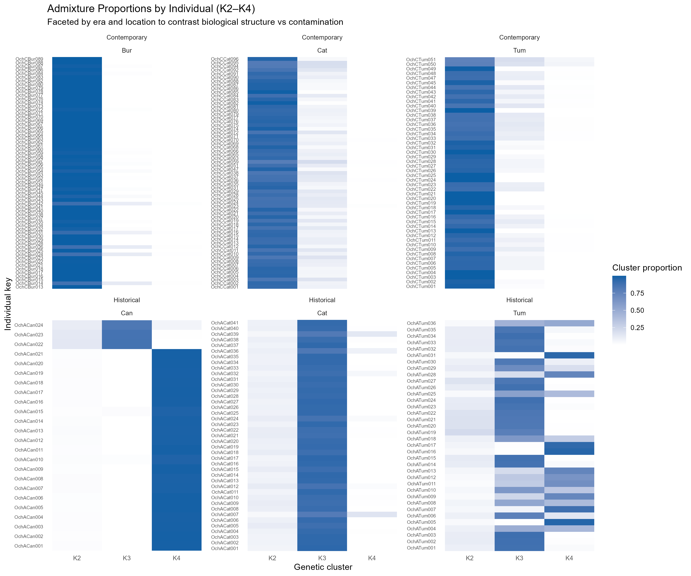
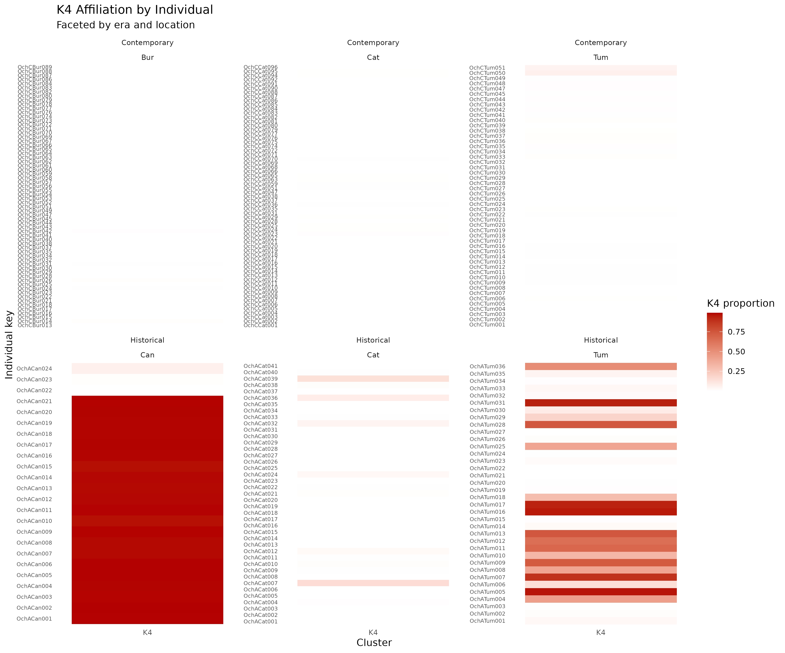

# TODO 3 Results

Outputs from tissue subsampling order tests.
- [tissue_subsampling_adjacency_metrics.csv](tissue_subsampling_adjacency_metrics.csv): per-group adjacency and periodic metrics.
- [tissue_subsampling_permutation_summary.csv](tissue_subsampling_permutation_summary.csv): permutation-based summaries and p-values.
- [tissue_subsampling_permutation_distributions.csv](tissue_subsampling_permutation_distributions.csv): full permutation distributions per group.
- `tissue_subsampling_admixture_heatmap.png`: heatmap of K2–K4 proportions by individual, faceted by era and location.
- `tissue_subsampling_k4_heatmap.png`: heatmap of K4 proportions only, faceted by era and location.

Interpretation:
- Use [tissue_subsampling_permutation_summary.csv](tissue_subsampling_permutation_summary.csv) to identify groups (by `date_subsampling_date` and `subsampler`) with low empirical p-values, indicating non-random adjacency or periodic patterns in `admixedness`.
- `adj_abs_diff_mean` reflects average neighbor-to-neighbor changes in `admixedness`; higher-than-expected values suggest abrupt shifts between consecutive samples.
- `high_low_transition_rate` captures switches between lower and higher quantiles of `admixedness` without hard thresholds.
- `period2_corr` and `period3_corr` summarize similarity to alternating or every-third patterns; compare observed values to permutation means and p-values.
- `tissue_subsampling_admixture_heatmap.png` helps visualize whether admixture patterns align with location/era structure (biological signal) versus scattered, isolated changes that could reflect contamination.
- `tissue_subsampling_k4_heatmap.png` isolates K4 patterns to highlight potential mixing specific to that cluster.

Plots:

