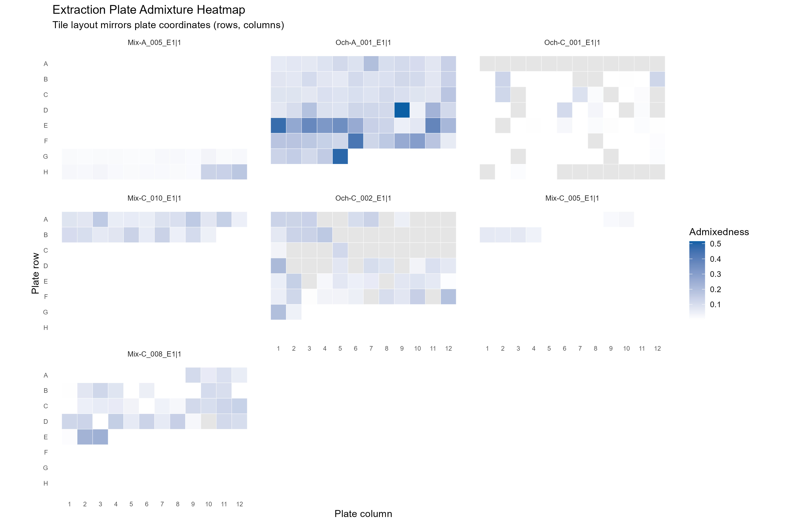
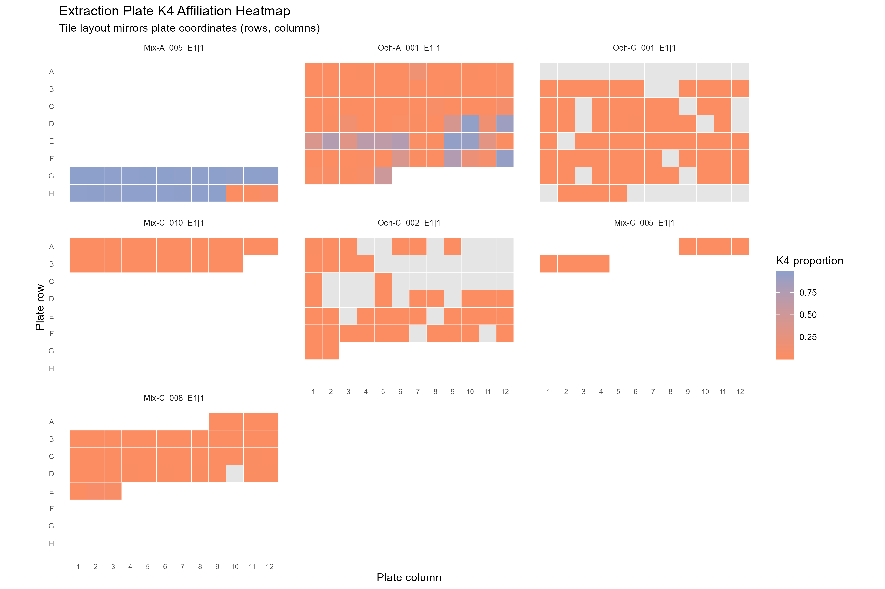
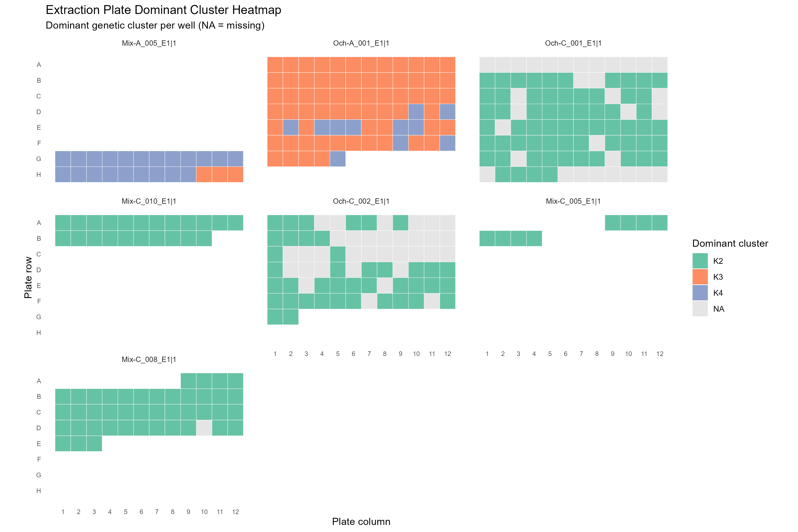
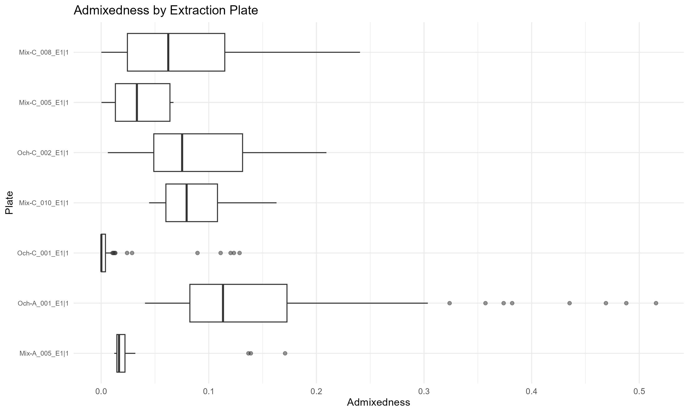

# TODO 5 Results

Outputs from extraction plate adjacency tests.
- [extraction_plate_adjacency_metrics.csv](TODO-05/extraction_plate_adjacency_metrics.csv): per-plate adjacency metrics across 4-neighbor wells.
- [extraction_plate_permutation_summary.csv](TODO-05/extraction_plate_permutation_summary.csv): permutation-based summaries and p-values.
- [extraction_plate_permutation_distributions.csv](TODO-05/extraction_plate_permutation_distributions.csv): full permutation distributions per plate.
- [extraction_plate_diagnostics.csv](TODO-05/extraction_plate_diagnostics.csv): counts of missing or duplicated plate coordinates.
- [extraction_plate_counts.csv](TODO-05/extraction_plate_counts.csv): well counts and missingness per plate and elution.
- [extraction_plate_admixedness_heatmap.png](TODO-05/extraction_plate_admixedness_heatmap.png): plate-layout heatmaps of continuous admixedness, faceted by plate.
- [extraction_plate_k4_heatmap.png](TODO-05/extraction_plate_k4_heatmap.png): plate-layout heatmaps of K4 affiliation, faceted by plate.
- [extraction_plate_cluster_heatmap.png](TODO-05/extraction_plate_cluster_heatmap.png): plate-layout heatmaps of dominant clusters, faceted by plate.
- [extraction_plate_admixedness_boxplot.png](TODO-05/extraction_plate_admixedness_boxplot.png): per-plate admixedness distribution summary.

Interpretation:
- Use [extraction_plate_permutation_summary.csv](TODO-05/extraction_plate_permutation_summary.csv) to identify plates with low empirical p-values, indicating non-random adjacency patterns in `admixedness` or dominant clusters.
- `adj_abs_diff_mean` and `adj_abs_diff_median` summarize how sharply `admixedness` changes between neighboring wells (up/down/left/right).
- `cluster_mismatch_rate` captures how often adjacent wells have different dominant clusters; elevated values may indicate spatial mixing on the plate.
- Check [extraction_plate_diagnostics.csv](TODO-05/extraction_plate_diagnostics.csv) for missing or duplicated coordinates that could bias adjacency metrics and [extraction_plate_counts.csv](TODO-05/extraction_plate_counts.csv) to confirm plate sizes.
- [extraction_plate_admixedness_heatmap.png](TODO-05/extraction_plate_admixedness_heatmap.png) highlights spatial gradients or patchiness in admixedness.
- [extraction_plate_k4_heatmap.png](TODO-05/extraction_plate_k4_heatmap.png) isolates K4 spatial patterns within plates.
- [extraction_plate_cluster_heatmap.png](TODO-05/extraction_plate_cluster_heatmap.png) shows spatial mixing of dominant clusters across the plate.
- [extraction_plate_admixedness_boxplot.png](TODO-05/extraction_plate_admixedness_boxplot.png) helps compare overall admixedness distributions across plates.

Flagged plates (min p-value across metrics <= 0.05):
| plate_key | plateid | elution | n_wells | n_missing_admixedness | min_p | min_metric |
| --- | --- | --- | --- | --- | --- | --- |
| Och-A_001_E1\|1 | Och-A_001_E1 | 1 | 77 | 0 | 0.000 | adj_abs_diff_median_p_value |
| Mix-A_005_E1\|1 | Mix-A_005_E1 | 1 | 24 | 0 | 0.005 | adj_abs_diff_mean_p_value |
| Mix-C_008_E1\|1 | Mix-C_008_E1 | 1 | 43 | 1 | 0.013 | adj_abs_diff_mean_p_value |

Plots:

