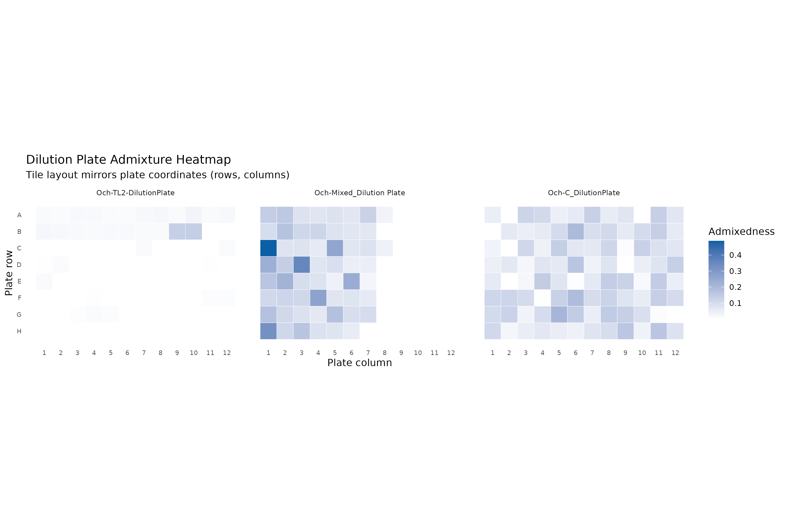
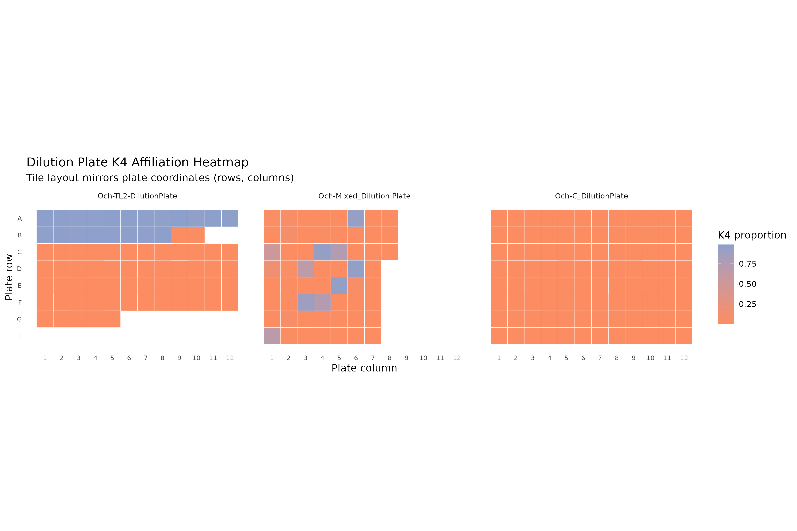
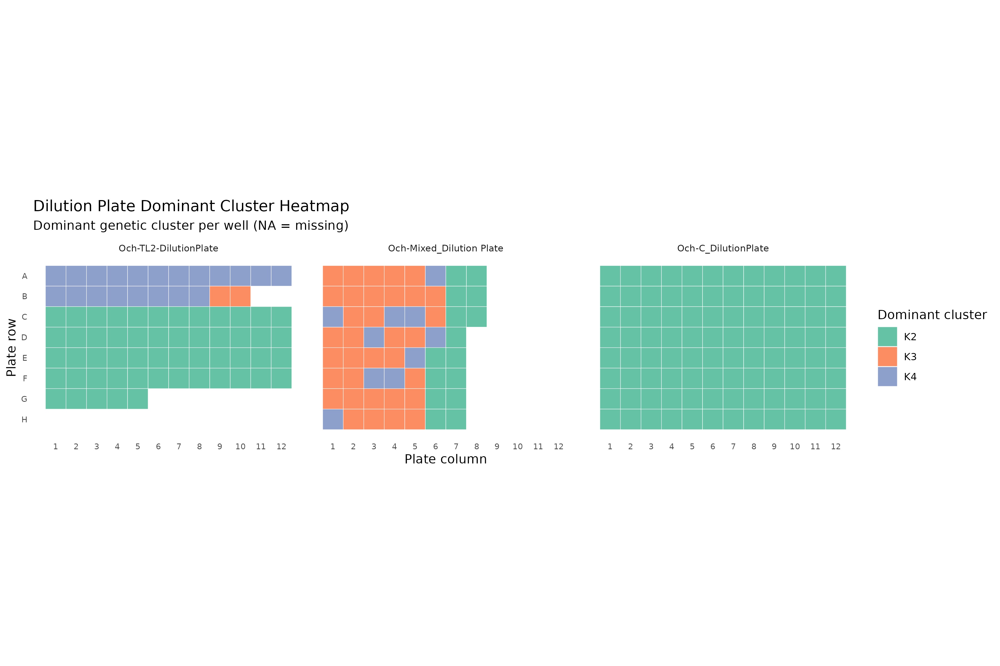
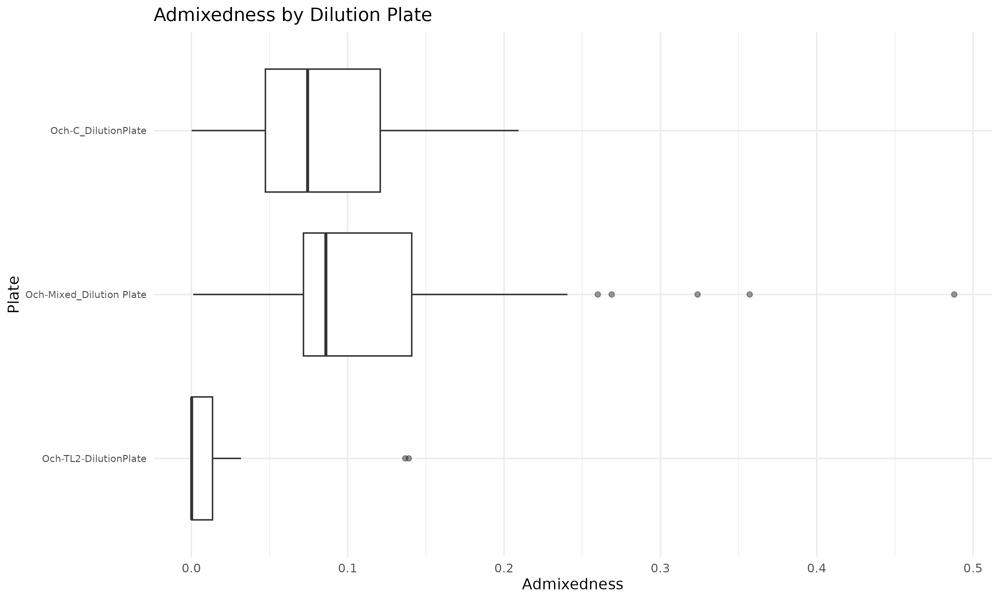

# TODO 7 Results

Outputs from dilution plate adjacency tests.
- [dilution_plate_adjacency_metrics.csv](dilution_plate_adjacency_metrics.csv): per-plate adjacency metrics across 4-neighbor wells.
- [dilution_plate_permutation_summary.csv](dilution_plate_permutation_summary.csv): permutation-based summaries and p-values.
- [dilution_plate_permutation_distributions.csv](dilution_plate_permutation_distributions.csv): full permutation distributions per plate.
- [dilution_plate_diagnostics.csv](dilution_plate_diagnostics.csv): counts of missing or duplicated plate coordinates.
- [dilution_plate_counts.csv](dilution_plate_counts.csv): well counts and missingness per plate.
- `dilution_plate_admixedness_heatmap.png`: plate-layout heatmaps of continuous admixedness, faceted by plate.
- `dilution_plate_k4_heatmap.png`: plate-layout heatmaps of K4 affiliation, faceted by plate.
- `dilution_plate_cluster_heatmap.png`: plate-layout heatmaps of dominant clusters, faceted by plate.
- `dilution_plate_admixedness_boxplot.png`: per-plate admixedness distribution summary.

Interpretation:
- Use [dilution_plate_permutation_summary.csv](dilution_plate_permutation_summary.csv) to identify plates with low empirical p-values, indicating non-random adjacency patterns in `admixedness` or dominant clusters.
- `adj_abs_diff_mean` and `adj_abs_diff_median` summarize how sharply `admixedness` changes between neighboring wells (up/down/left/right).
- `cluster_mismatch_rate` captures how often adjacent wells have different dominant clusters; elevated values may indicate spatial mixing on the plate.
- Check [dilution_plate_diagnostics.csv](dilution_plate_diagnostics.csv) for missing or duplicated coordinates that could bias adjacency metrics and [dilution_plate_counts.csv](dilution_plate_counts.csv) to confirm plate sizes.
- `dilution_plate_admixedness_heatmap.png` highlights spatial gradients or patchiness in admixedness.
- `dilution_plate_k4_heatmap.png` isolates K4 spatial patterns within plates.
- `dilution_plate_cluster_heatmap.png` shows spatial mixing of dominant clusters across the plate.
- `dilution_plate_admixedness_boxplot.png` helps compare overall admixedness distributions across plates.

Plots:

