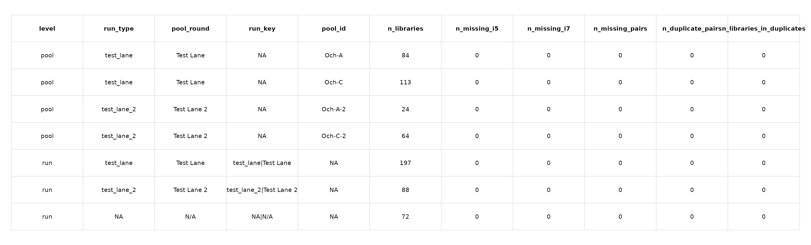

# TODO 8 Results

Outputs from index integrity checks within sequencing pools and runs.
- [index_pair_duplicates_by_pool.csv](TODO-08/index_pair_duplicates_by_pool.csv): detailed duplicate i5+i7 index pairs within each pool.
- [index_pair_duplicate_summary.csv](TODO-08/index_pair_duplicate_summary.csv): summary of duplicates and missing index values by pool and by run.
- [index_pair_duplicate_summary.png](TODO-08/index_pair_duplicate_summary.png): rendered table of the summary for quick review.

Interpretation:
- Use [index_pair_duplicates_by_pool.csv](TODO-08/index_pair_duplicates_by_pool.csv) to identify pools where multiple libraries share the same i5+i7 index pair.
- [index_pair_duplicate_summary.csv](TODO-08/index_pair_duplicate_summary.csv) reports pool-level and run-level duplicate counts and highlights missing index values that need follow-up.

Plots:

